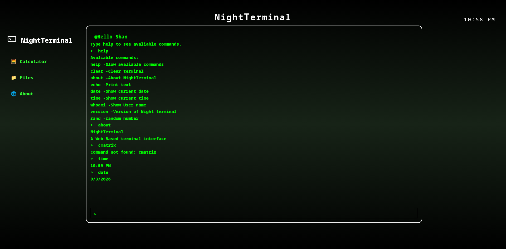

# NightTerminal

A simple web-based fake terminal interface build in basic HTML, CSS and JavaScript. It has Terminal named NightTerminal. I made it for vibe only. No backend, no file system cause just type and get respoonse.

## Preview

# Stack
Just HTML, CSS and vanilla JS. No frameworks, on purpose — wanted this to be with zero dependencies. It has a following commands:

## Commands
* `help`- Shows all commands
* `clear` - Clears the terminal
* `about` - Shows information 
* `echo` - Prints text
* `date` - Shows the current date
* `time` - Shows the current time
* `whoami` - Shows the username
* `version` - Shows version
* `random` - Generate a random numbers between 1 to 100

# Issues 
I don't know how to add file system, not complex things. Just learning

I made it just for vibe a revision
Just add name and start

